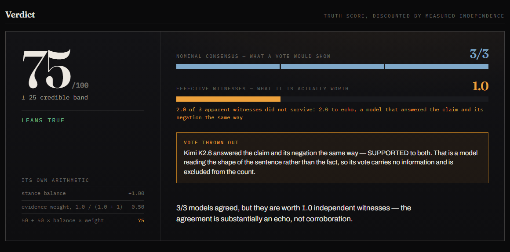

# NEFF

**Three models agreeing is one witness if they all read the same page.**

NEFF is a fact checker that treats model agreement as a claim to be verified rather than as
evidence. Every inference runs on the [Gonka Network](https://gonkarouter.io) — eleven per check, each
traceable to the node that served it.



*A real report, unedited. Three of three models said the claim was true — and every one of them also
said its negation was true. A vote would have called this unanimous. NEFF calls it **NO SIGNAL on
0.0 witnesses**, and shows you the transcripts.*

**Watch the pitch** *(link to follow)* — two live fact-checks, recorded from the real
app.

```
./init.sh          # clean checkout to a running demo, with a live Gonka connectivity check
```

---

## Why NEFF

**N_eff** is the effective sample size: how much independent information a set of correlated
observations actually carries. Ask nine models to check a claim and you do not have nine opinions —
they share training data, reasoning habits, biases, and failure modes. The estimator that prices
that is Kish's, and it has already been applied to an LLM panel in
[*Nine Judges, Two Effective Votes*](https://arxiv.org/abs/2605.29800), which measures nine frontier
models as carrying about **two** independent votes.

So instead of counting how many models agree, NEFF asks the question that decides what the agreement
is worth:


That is the whole identity of the product. **NEFF does not claim to know the truth. It measures how
much the consensus is worth.** And because every inference runs on Gonka, the parts compose:
decentralized inference, several independent judges, an effective-independence measurement, the
evidence each judge named, and a Gonka Request ID for every call so the provenance is checkable.

## In ninety seconds

**The problem.** Fact checkers poll several models and average the votes, assuming the models are
independent. They are not: they share training data and make the same mistakes, and a measured panel
of nine LLM judges is worth about [two independent votes](https://arxiv.org/abs/2605.29800). So they
are most confident exactly when the models are wrong together.

**Why not the obvious approach.** N verifiers, averaged scores, request IDs on screen — that build has
already won a hackathon, and it ships the bug above.

**How it works.** Each model is asked three things, in three separate requests: the claim; the claim
*negated*, presented blind as though it were the original; and what evidence it is leaning on. Answer
the claim and its negation the same way and you are reading the sentence, not the fact — vote
discounted to zero. Lean on the same evidence as another model and you are one witness, not two. Out
comes an **Effective Witness Count**, and the truth score is shrunk to match.

**What that buys.** The screenshot above: three models unanimously agreeing, scored at **0.0 effective
witnesses**, with the six answers that prove it. No vote can produce that sentence.

**How to see it.** `./init.sh`, then click an example, or pick one of the claims the landing
page says have already been checked here — or watch
the pitch recording. Every inference in a check — eleven of them, twelve if a
node has to be replaced — runs on the Gonka Network, each listed with its request ID and serving node.

**Why it is not a reskin.** Neither ingredient is new on its own — the estimator is standard, and
auditing a model by checking its own consistency is
[published work](https://arxiv.org/abs/2306.09983). What does not exist is the combination, shipped
to a reader: a blind-negation gate on each vote, times a query-time measurement of how much evidence
those votes share, printed as one witness count with the transcript that justifies it. Full search in
a full prior-art search; honest limits [below](#what-this-does-not-do).

---

## The problem with the obvious build

The obvious decentralised fact checker asks N models "is this true?", averages their answers, and
prints a confident number. Its whole claim to neutrality is that several independent models agreed.

They are not independent. Frontier language models share pretraining corpora, distillation ancestry
and alignment pipelines, and they make the same mistakes as a result.
[*Nine Judges, Two Effective Votes*](https://arxiv.org/abs/2605.29800) measures a panel of nine LLM
judges and finds it "effectively provide[s] only about 2 independent votes' worth of information" —
three quarters of the panel's nominal independence lost to correlated error, and an accuracy gap of
8–22 points against what genuinely independent voting would achieve.
[arXiv:2604.07650](https://arxiv.org/abs/2604.07650v1) finds the same thing from the other direction:
the more entangled the judges, the worse the bias, and reweighting by measured independence beats
majority voting by up to 4.5%. Majority voting only improves on a single model when errors are
*uncorrelated* — that is the premise of the Condorcet Jury Theorem, and it is exactly the premise a
panel of LLMs violates.

So the naive design fails in the worst possible direction: it is *most* confident precisely when the
models are wrong together. A unanimous panel prints 95% and moves on.

## What NEFF does instead

For every claim, each model on the panel is asked three separate, isolated questions:

| Probe | What it asks | What it catches |
|---|---|---|
| **claim** | Assess this claim. Name your evidence. | the stance and confidence |
| **mirror** | *(the claim's negation, presented blind as if it were the original)* | a model that answers the claim and its negation the same way is reading the shape of the sentence, not the fact — its vote carries no information |
| **evidence** | What body of evidence does this rest on? | models leaning on the *same* source are one witness, not three |

Those two measurements produce the number the whole product exists to report:

> **Effective Witness Count** — how many genuinely independent verifiers are behind a verdict.

It is Kish's effective sample size for correlated observations — the standard design-effect
correction, already applied to LLM panels in *Nine Judges, Two Effective Votes*:

```
EWC = k / (1 + (k − 1) · ρ)
```

where `k` is the count of agreeing models weighted by whether each passed its mirror probe, and `ρ`
is their measured evidence overlap. The estimator is not the contribution here; measuring `ρ` per
claim, at query time, from the models' own stated evidence — and putting the result in front of the
reader as part of the verdict — is. When a model will not name a source, `ρ` for that pair cannot be
measured, and a documented prior is used instead and **labelled as assumed on screen**; the prior is
derived by inverting the same estimator on that paper's nine-judges-two-votes result, giving 0.44.

Three models on three distinct sources gives 3. Three models on one source gives exactly 1. A panel
where every model failed the mirror probe gives 0.

The truth score is then shrunk toward "unresolved" by `EWC / (EWC + 1)`, so a verdict can only be as
confident as the independent evidence behind it — and **no verdict ever reaches 0 or 100**, because a
panel of language models is evidence, never proof.

Every constant in that arithmetic is written out in [`METHOD.md`](METHOD.md), and the report itself
opens the same derivation under the formula. Each one carries one of three honest labels: a
**definition** that follows from the 0–100 scale and has nothing to tune, a **standard** estimator
used as published with the source named, or a **choice** we made — with the reasoning, and with the
direction it errs. There are two of the last kind. The shrinkage prior is set at one pseudo-witness
because that is the smallest value that stops a single independent witness from ever producing a
SUPPORTED verdict. The anchor-match threshold is set at 0.6 because, swept across every real
anchor pair this build has stored, a looser value finds more echoes and tells this project's story
better — so 0.6 credits the panel with more independence than it probably has, which is the only
direction an error here can be defended in. `npm run sweep:threshold` reproduces that sweep from the
stored runs, in a couple of seconds and with no Gonka calls; it prints live figures rather than the
ones quoted in [`METHOD.md`](METHOD.md), which are a stamped snapshot.

### What that looks like in practice

Every number below came off a real run against the live router. The models are not deterministic
across nodes, so a re-run can land differently — which is the point: the number tracks what the panel
actually did that time, not a fixed opinion about the claim.

- *"Taking vitamin C supplements prevents the common cold."* — **3 of 3 models agreed it is false.**
  All three named the same Cochrane systematic reviews: 89% measured evidence overlap, **1.1
  effective witnesses**. The naive build reports unanimity. NEFF reports one witness, quoted three
  times. (Reproducible from the first example button; observed at 1.08 across separate runs.)

- *"The Anglo-Zanzibar War of 1896 lasted under forty-five minutes."* — **all three models answered
  SUPPORTED to the claim and SUPPORTED to its negation.** The war is famous for being about forty
  minutes long, and the models are pattern-matching the famous fact rather than reading the boundary
  the claim actually sets. Every vote is thrown out: 3/3 nominal, **0.0 effective witnesses, NO
  SIGNAL**. That is the screenshot at the top of this page, and it is the clearest statement of the
  whole argument: a unanimous panel that knows nothing.

- *"The Great Wall of China is visible from the Moon with the naked eye."* — the honest counter-case.
  One run had the three models naming three different evidence bases and the agreement **held at 3.0
  effective witnesses**; another had them overlapping and it fell to 1.7. A metric that only ever said
  "echo" would be worthless, and this one does not.

- *A Wikipedia article on the Streisand effect* — pasted as a link. NEFF fetches the page, reduces
  it to one atomic checkable claim, and verifies that: 3 of 3 coherent, **1.8 effective witnesses**
  after their partial evidence overlap is priced in.

Products exist that flag a single model's answer as low-trust — Cleanlab's Trustworthy Language Model
scores self-consistency across resamples, for instance. What none of them report is *how many
independent witnesses stand behind a verdict*, with the probe transcript that shows which one was
discarded and why.

## What you get back

- a **Truth Score** from 0 to 100 with a credible band derived from the Effective Witness Count, and
  the arithmetic that produced it, on screen
- the **load-bearing fact** the verdict rests on, and **what evidence would flip it**
- a **panel view**: every model's stance, confidence, reasoning, evidence base, and its answer to the
  mirror probe next to its answer to the claim
- a **receipt ledger**: every inference in the run with its Gonka request id, the devshard node
  that served it, the engine build, latency, tokens, and the full request and response — expand any
  row, copy the request body, and re-run that exact step against the same gateway yourself
- a permanent link to the report

## What this does not do

A tool whose whole argument is "your confidence is overstated" has no business overstating its own.

- **The evidence anchors are self-reported.** A model can name a source it never read, or confabulate
  one outright. NEFF does not treat an anchor as evidence *for the claim* — it never scores a
  source's reliability — it uses anchors only as a **dependence signal**: two models describing the
  same evidence base are behaving alike, which is informative about correlation whether or not the
  base is real. They are requested in English even when the claim is not, because comparing them
  across models needs one shared vocabulary and a token matcher cannot match paraphrases across
  languages.
- **A failed mirror probe costs a witness even when the network was at fault.** A model whose mirror
  call times out cannot be shown to discriminate, so it is not counted. That is deliberately the
  conservative direction — unmeasured is not the same as independent — and the report always says
  which it was.
- **The Effective Witness Count is a floor on the discount, not a per-decision measurement.** The
  estimator assumes the agreeing models are exchangeable, and they are not exactly — they differ in
  size and training. Read it as a reason to distrust a unanimous card and go and check the
  load-bearing fact, which is why the transcript is on the same page, and not as a calibrated
  probability.
- **UNCERTAIN on both sides is scored as partial, not as an echo.** A model that is honestly unsure
  about a claim and its negation is being consistent, not pattern-matching, and is not punished as
  though it were.
- **Three models is a small panel.** The mechanism generalises to more, and would report more
  precisely with more; three is what the Gonka Router currently serves.
- **Comparing anchors is a token match, not semantic understanding.** Two models can describe the
  same source in words that share nothing, and the overlap will read lower than it truly is. That
  errs toward reporting *more* independence than there is, which is the direction that flatters a
  verdict — so it is a real limit, not a conservative one.
- **A verdict is evidence, never proof.** Nothing here reaches 0 or 100, and a Truth Score is a
  reason to go and look at the load-bearing fact, not a reason to stop looking.

## How it uses Gonka

Every piece of reasoning in this application runs on `api.gonkarouter.io`. There is no other
inference provider in the codebase, not behind a flag and not commented out — `lib/gonka.ts` is the
only module that talks to a model, and there is deliberately no provider abstraction that would let
that change quietly. Details, including how the request ids are captured and what is *not* an
inference, are in [`docs/GONKA.md`](docs/GONKA.md).

Panel: `deepseek-ai/DeepSeek-V4-Flash-0731`, `MiniMaxAI/MiniMax-M2.7`, `moonshotai/Kimi-K2.6`.

## Why this is not a reskin

Decentralised multi-verifier fact checking has been built and has already won a hackathon, and
confidence-weighted model consensus has too. Both ship the same statistical bug: they treat agreement
as corroboration without ever checking whether the agreement is independent. NEFF inverts that
primitive — it measures verifier independence at query time and prices the verdict by it, which
produces an artifact none of them can produce: *"all three models agreed, that agreement is worth one
witness, and here is the probe transcript that proves it."* The full search, the candidates found,
and the argument were settled against a full prior-art search before the concept was locked.

## Running it

```bash
cp .env.example .env       # then put your Gonka Router key in it
./init.sh                  # installs, checks the router is reachable, starts on :3000
./init.sh --check          # environment and connectivity only
npm test                   # 50 unit tests over the scoring, parsing and URL guard
npm run test:live          # 4 tests against the live Gonka Router
npm run browser:check      # drives the real app in a browser and screenshots what it did
```

The key is read server-side only, from `.env`, which is git-ignored and has never been committed.

For a public URL: `npm run share` tunnels the local app and prints one, with no account needed; for a
real deployment it is four commands on Vercel. Both are in [`docs/DEPLOY.md`](docs/DEPLOY.md).

## Where things are

| Path | What it is |
|---|---|
| `lib/gonka.ts` | the only module that calls a model; captures request id, node id, usage |
| `lib/score.ts` | the argument: discrimination, evidence overlap, Effective Witness Count, truth score |
| `lib/prompts.ts` | the neutrality prompts, and why the mirror probe has to be blind |
| `lib/verify.ts` | the 11-call run, streamed as each node answers |
| `lib/extract.ts` | reading a pasted URL, and the SSRF guard that runs inside the connection |
| `components/Report.tsx` | verdict card, panel, receipt ledger |
| `tools/record-pitch.mjs` | records the pitch video by driving the real app through real runs |
| `tools/browser-check.mjs` | drives the app in a browser and reports what it saw; how features get verified |
| `METHOD.md` | every constant in the score, and where it came from |
