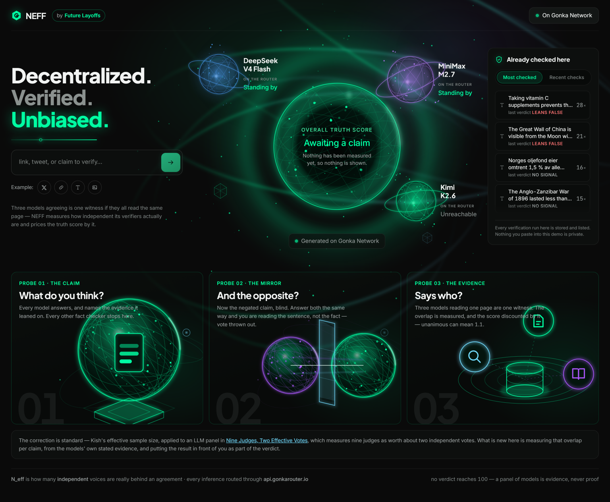
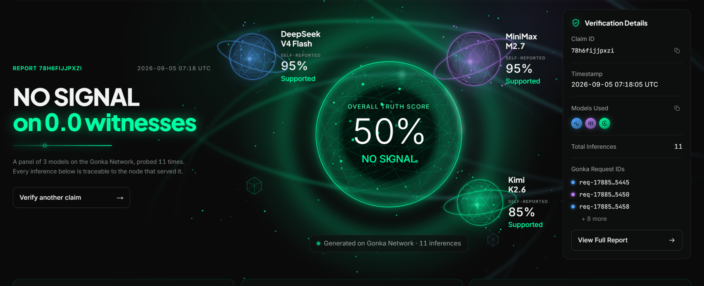
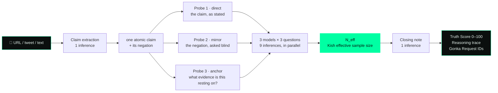
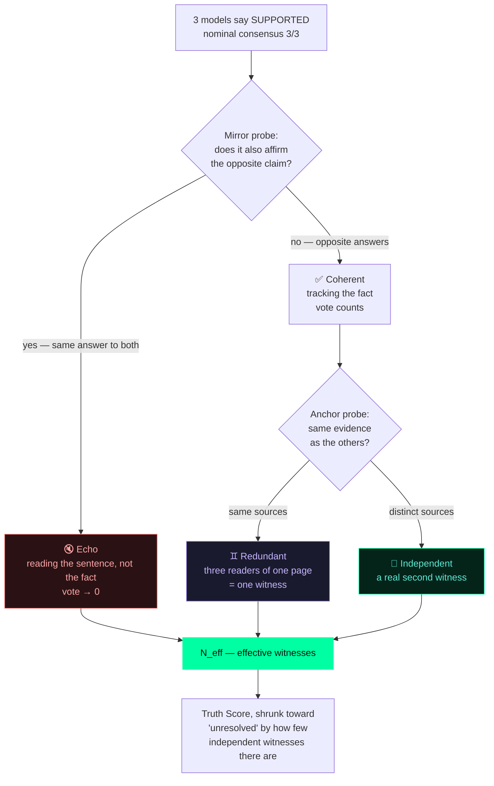
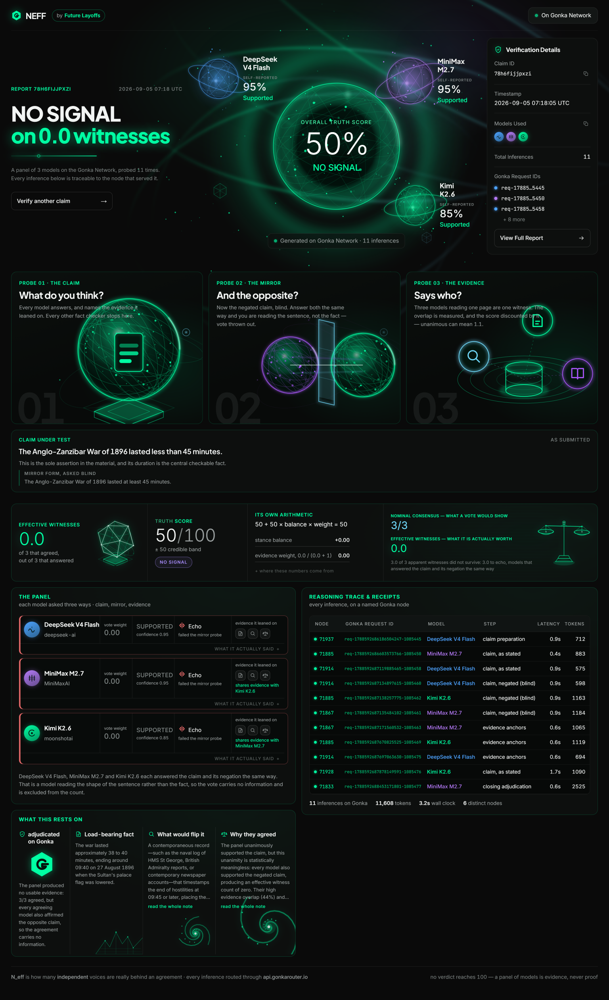

<div align="center">

# NEFF

### Nine models agreeing is not nine opinions.

**NEFF measures how many *independent* voices are really behind an AI consensus — and prices the
Truth Score by it.** The estimator is [Kish's effective sample size](https://en.wikipedia.org/wiki/Design_effect)
(*Survey Sampling*, 1965): `n_eff = n / Deff`, where `Deff = 1 + (n−1)ρ` discounts observations
that correlate. Here the correlated observations are the models, and **ρ is measured per claim**.

[](https://gonkarouter.io)
[](https://nextjs.org)
[](https://react.dev)
[](https://www.typescriptlang.org)
[](#run-it)

**[▶ Live demo](https://neff-six.vercel.app)** · **[▶ 2-min video](#)** · **[Method](METHOD.md)** · **[Gonka integration](docs/GONKA.md)**



</div>

---

## The bug in every multi-model fact checker

Poll several models, average the votes, call the agreement evidence. But models share training
data, reasoning habits and failure modes — so they are **wrong together**, and averaging is most
confident exactly when the panel is most likely to be wrong.

Measured, not asserted: a panel of 9 frontier LLMs carries about
**[two independent votes](https://arxiv.org/abs/2605.29800)**, not nine.

> **NEFF does not claim to know the truth. It measures what the consensus is worth.**



<div align="center"><sub>Real output. Three models said <b>SUPPORTED</b> at 95%, 95% and 85% — and every one of them
also said the <i>opposite</i> claim was supported. A vote calls that unanimous. NEFF calls it
<b>NO SIGNAL on 0.0 witnesses</b> and shows the six answers that prove it.</sub></div>

---

## How one verification works

**11 inferences, every one on the Gonka Network**, streamed to the browser as each node answers.



### Consensus logic — what happens to each vote



**When models disagree**, the panel is not silently averaged. The majority side is tallied
**weighted by each model's mirror-probe result**, so a model that failed the mirror cannot decide
which side wins. The split is reported on its face — *"The panel is split. On the minority side:
…"* — the dissent is priced into `N_eff`, and the closing note is asked for the **precise point of
contention** rather than a summary.

---

## Core functionality → where it lives

| The brief asks for | NEFF | Code |
|---|---|---|
| **Claim Extraction** — URL, tweet or text | One **atomic** claim + a faithful negation. Compound claims are rejected — they break the mirror probe | [`lib/extract.ts`](lib/extract.ts) · [`lib/prompts.ts`](lib/prompts.ts) |
| **Decentralized Verification** — Gonka models | 9 probes in parallel across independent nodes, adaptive concurrency, deadline-aware retries | [`lib/verify.ts`](lib/verify.ts) · [`lib/gonka.ts`](lib/gonka.ts) |
| **Truth Score & Reasoning Trace** | `0–100` + credible band, **its own arithmetic on screen**, every model's full reasoning and named evidence | [`lib/score.ts`](lib/score.ts) · [`METHOD.md`](METHOD.md) |
| **Transparency UI** — Gonka Request IDs | Receipt ledger: `x-request-id`, serving node, engine build, latency, tokens, **and the exact request body** | [`components/ReceiptLedger.tsx`](components/ReceiptLedger.tsx) |

<div align="center">

</div>

---

## Gonka Router integration

> **Mandatory requirement: all AI reasoning runs on the Gonka Network.**
> Exactly **one** file in this repo talks to a model, and it has no provider abstraction —
> deliberately, so no future edit can quietly route inference elsewhere.

**[`lib/gonka.ts`](lib/gonka.ts)** — every call, every retry, every receipt:

```ts
const response = await fetch(`${GONKA_BASE_URL}/chat/completions`, {
  method: "POST",
  headers: { Authorization: `Bearer ${key}`, "Content-Type": "application/json" },
  body: JSON.stringify({ model, messages, temperature: 0, max_tokens }),
  cache: "no-store",          // inference is never cacheable — and Next stalls without this
});

// The Gonka Request ID is in the *headers*, not the body.
const requestId  = response.headers.get("x-request-id");    // req-1788473643105856296-578027
const devshardId = response.headers.get("x-devshard-id");   // which node actually served it
```

**The panel**, all Gonka-hosted ([`lib/models.ts`](lib/models.ts)):

| Model | Role | Per-model handling |
|---|---|---|
| `deepseek-ai/DeepSeek-V4-Flash-0731` | witness · claim extraction | shortest output of the three |
| `MiniMaxAI/MiniMax-M2.7` | witness · closing note | chain-of-thought inline in `<think>`, billed against `max_tokens` |
| `moonshotai/Kimi-K2.6` | witness | `chat_template_kwargs: { thinking: false }` — else ~2000 reasoning tokens per probe |

Neutrality is enforced in the protocol, not just the prompt: no probe is told what the others said,
the mirror probe is a **separate request with no shared context**, and a model that cannot name
concrete evidence is told to answer `UNCERTAIN` rather than guess.
Full notes: **[`docs/GONKA.md`](docs/GONKA.md)**.

---

## The score, and why you can check it

```
Truth Score = 50 + 50 × balance × weight

   balance  −1…+1   confidence-weighted stance of the panel
   weight   n/(n+1) conjugate-prior shrinkage, n = N_eff
   N_eff    k / (1 + (k−1)·ρ)     Kish 1965 — ρ measured per claim,
                                  from the evidence the models themselves named
```

Every constant is labelled on screen as **definition** (it follows from the 0–100 scale),
**standard** (a published estimator, source named) or **chosen** (we picked it — with the reasoning,
and which way it errs). `npm run sweep:threshold` reproduces the argument for the one free
parameter from the runs on disk, in two seconds, with no Gonka calls. Long form: **[`METHOD.md`](METHOD.md)**.

> No verdict ever reaches 0 or 100. A panel of language models is evidence, never proof.

---

## Why this is not the obvious build

N verifiers, averaged scores, request IDs on screen — that build has **already won a comparable
hackathon**, and it ships the correlation bug above. Neither ingredient here is new alone: the
estimator is 60 years old, and probing a model against its own negation is
[published work](https://arxiv.org/abs/2306.09983). What does not exist is the combination, shipped
to a reader: **a blind-negation gate on every vote, times a query-time measurement of how much
evidence those votes share, printed as one witness count with the transcript that justifies it.**

---

## Run it

```bash
cp .env.example .env      # add your Gonka Router key
./init.sh                 # checks toolchain, key and live Gonka connectivity, then starts
```

| Command | What it does |
|---|---|
| `npm test` | 78 unit tests — scoring, parsing, retry policy, answer recovery |
| `npm run test:live` | live suite against the real Gonka Router |
| `npm run check:claim -- "<claim>"` | drives one real verification, prints every probe and retry |
| `npm run sweep:threshold` | reproduces the anchor-threshold argument from `.runs/` |

```
lib/gonka.ts     the only file that talks to a model — retries, receipts, redaction
lib/verify.ts    the 11-inference run, streamed as SSE
lib/score.ts     N_eff, the mirror gate, the anchor overlap — the whole argument
lib/prompts.ts   every prompt, including the blind negation
app/api/verify   the SSE endpoint      components/  the dashboard
```

---

## What this does not do

Stated plainly, because a fact checker that hides its limits has no business asking for trust.

- **Text only.** The Gonka Router rejects image content (`unsupported value "image_url"`), and the
  brief makes Gonka mandatory for all reasoning — so there is no image path rather than a
  non-Gonka one.
- **No live web search.** Verification runs against the models' internal knowledge and the page you
  paste. Anchors name *bodies of evidence*, never fabricated citations.
- **Nothing is written to a chain.** On-chain proof is satisfied as the brief defines it
  operationally — every inference shows its Gonka Request ID and serving node.
- **`x.com` links cannot be read** server-side. Paste the post's text instead; it verifies the same.

<div align="center">

**N_eff is how many independent voices are really behind an agreement.**
Every inference routed through `api.gonkarouter.io`.

</div>
